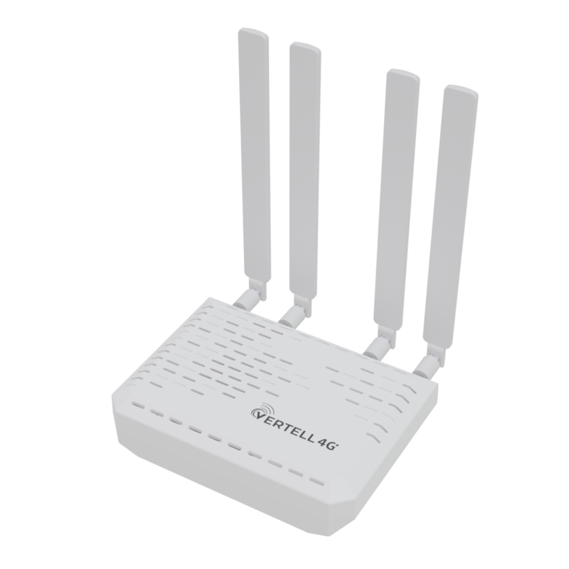

# Fibocom L860-GL

## Модем M.2 VT-STATION-M.2 Cat. 16
https://vertell.ru/product/47-modem-m-2-vertell-vt-usbc2-cat-16/

Модем M.2 VT-STATION-M.2 в корпусе на базе Fibocom L860-GL — сотовый модуль в компактном исполнении, разработанный для использования в бытовой и промышленной электронике. Модем поддерживает категорию LTE Cat. 16 и способен загружать данные на скорости до 480 Мбит/с. Высокая скорость интернет-соединения достигается сочетанием нескольких технологий:

Агрегация нескольких полос частот (Carrier Aggregation) для расширения пропускной способности. Модуль L860-GL поддерживает агрегацию до 5-ти полос (в России на практике операторы используют агрегацию до 3-х полос частот). Полный список доступных комбинаций агрегации приведён в файле спецификаций, который доступен для загрузки в конце страницы;

Современная модуляция 256QAM, которая использует более сложное кодирование сигнала для расширения ёмкости канала;

Многоканальный режим MIMO 4x4 задействует до четырёх пространственных потоков (требуется подключение 4 антенн).

Устройство в пластиковом корпусе со слотом под nano-SIM карту и разъёмом питания Type-C. Питание модема осуществляется по USB кабелю из комплекта. В случае необходимости дополнительного питания необходимо подключить блок питания 12V, 1-2А, разъём 5,5х2,1 мм. Модем поддерживает автоматическое переключение питания! Перемычку переставлять не требуется.

### Расположение антенн на корпусе принципиально!

При использовании антенны с технологией MIMO 4х4 разъёмы 1 и 2 на модеме подключаются к одной паре поляризации антенны, разъёмы 3 и 4 к другой паре поляризации антенны. При этом 1 и 3 подключаются к разъёмам вертикальной поляризации, разъёмы 2 и 4 - к разъёмам горизонтальной поляризации.

Модем VT-STATION-M.2 ведёт себя стабильно в работе при слабом сигнале благодаря надёжной цепи питания. В просторном и надёжном корпусе ваш модем не будет греться. Установлен дополнительный радиатор охлаждения на модеме.

Подключение модема к внешней антенне осуществляется через разъёмы на торцевой вставке корпуса. Подключение модема внутри осуществляется с помощью четырёх пигтейлов с разъёмами MHF4(IPEX4) для модемов M.2. Разъём антенн 50 Ом SMA-female.

Модем работает как с роутерами, так и с ПК (после настройки). Для подключения к ПК необходимо установить драйверы для USB-устройства. Необходимые драйверы можно найти в "Приложении" внизу страницы товара. Поддерживается работа на ОС Windows 10, 11 и Linux.

Модем M.2 VT-STATION-M.2 Cat. 16 разработан, произведён и сертифицирован в России.

Преимущества и особенности:

Высокая скорость загрузки до 480 Мбит/с;

Поддержка всех частотных диапазонов для быстрого интернета в России;

Поддержка со стороны известного производителя электроники VERTELL.

### Основные характеристики
Тип продукта	Модем
Диапазон температур	0 ... +40 °C
Интерфейс	USB
Вес	285 г
Гарантия	1 месяц

Диапазон частот:
- LTE FDD B1, B2, B3, B4, B5, B7, B8, B11, B12, B13, B17, B18, B19, B20, B21, B26, B28, B29, B30, B66;
- LTE TDD B38, B39, B40, B41;
- WCDMA B1, B2, B4, B5, B8.

Скорость передачи данных	LTE до 480 Мбит/с

Категория LTE	16

Тип антенных разъёмов	SMA-female (50 Ом)

Слот SIM-карты	Nano-SIM

Напряжение питания 	5 В

Размеры корпуса	140х100х35 мм

Комплектация  	
- Модем VT-STATION-M.2 Cat. 16 – 1 шт.
- Антенна  VT-ANT-M2-SMAM - 4 шт.
- Кабель USB Type-C 0,5 м 6 А - 1 шт.

Страна изготовления	Россия

## Документация на сам модуль
[fibocom_l860gl_datasheet_v1.0.pdf](fibocom_l860gl_datasheet_v1.0.pdf)