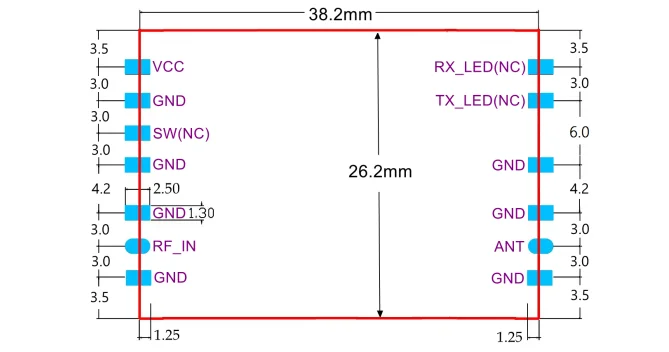
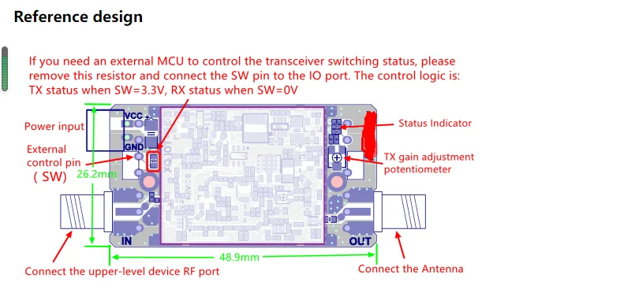

# AB-IOT-868

## Technical Specification

868MHz Band Bi-directional signal amplification module

Model：AB-IOT-868

### Introduction
The AB-IOT-868 Series Bi-directional signal amplification module is suitable for micro-power wireless products in the frequency range of 850MHz-930MHz. It is suitable for various IoT wireless data acquisition products working in the 868MHZ frequency band in Europe and the 902MHZ-928MHZ frequency band in North America.

### Main characteristics

1. Built-in TX/RX automatic switching circuit, TX/RX status can be switched independently without external control signal.

2. It works in RX status by default, and enhances the receiving signal. When the transmitting signal of the superior device is detected, the module instantly switches to the TX status.

3. The TX gain is adjustable, which is convenient to be compatible with wireless devices with different transmission powers.

4. Compatible with various modulation methods such as LORA and FSK/ASK/OOK/MSK/GFSK.

### Specifications

**Working frequency：** 850MHz  930MHz

**RX gain：** 11dB±2dB

**NF：** 2.0dB

**TX gain：** 5dB  11dB (±2dB)Adjustable 

**TX/RX switching threshold：** -2dBm

**TX input power range:** 1dBm - 20dBm

**Maximum transmit power：** 31dBm (1.3w)

Status indication ：

    RX status： Green light is on, Blue light is off 
    RX status： Blue light is on, Green light is off

Operating Voltage ： AB-IOT-868-A： 5V（4.75V-5.25V）

Working current ：

    **RX status ** 10mA（±3mA）
    **TX status：** 720mA

**Overall dimension:** 38.2mm*26.2mm*4.5mm(L*W*H)

**Tips:**  The output power of the upper-level device must be at least 3dB higher than the switching threshold, which means that the output power of the upper-level device cannot be lower than 1dBm, otherwise it may cause unstable operation.

#### Chang the TX Gain

- When the potentiometer is turned counterclockwise to the limit, the gain is 5dB；
- When the potentiometer is turned clockwise to the limit, the gain is 11dB.

### Overall dimensionand Pin description

1．The RF_IN pin is connected to the upper-level device RF signal output port.

2． The ANT pin is connected to the Antenna.

3． When the module outputs at maximum power, the current can reach 720mA，It is recommended to connect a large-capacity capacitor in parallel with the VCC pin, the capacity is not less than 220uF.

4 .  All pins marked with NC are used in specific occasions, please ignore them for general applications.

5 . This module supports the switching state of the transceiver is controlled by the MCU IO port.

## Reference design

