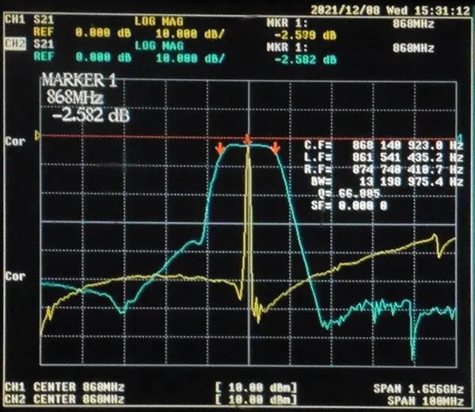
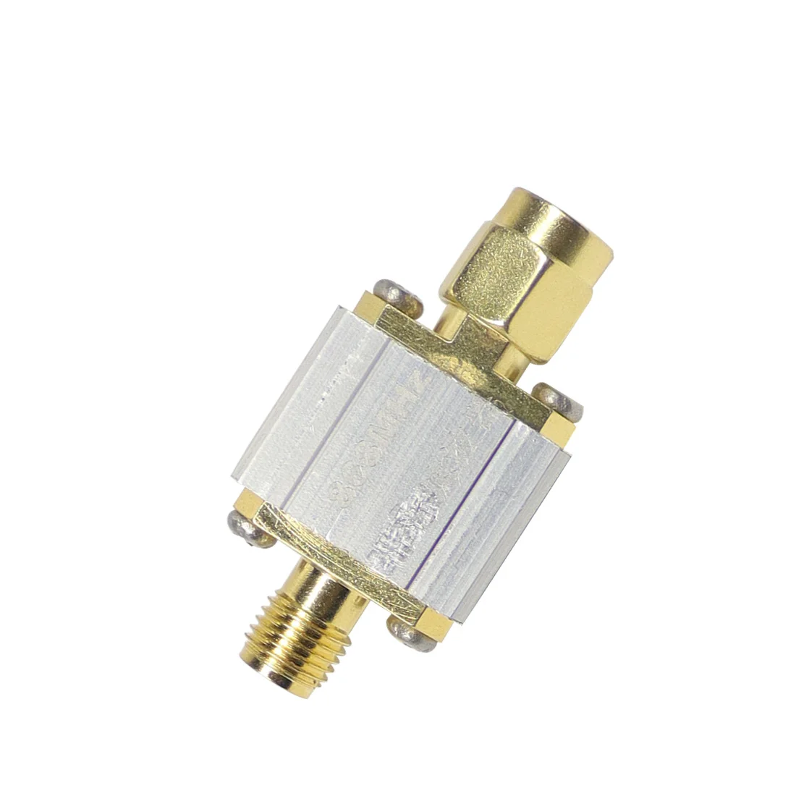

# FBP-868s
868MHz Filter TypeA:

The filter has a 1dB bandwidth of 4MHz, Cut-off characteristic steep.

Performance optimization for 868MHz RFID receivers, European standard LoRa IoT node devices. It can effectively filter out out-of-band signals, reduce noise, and increase dynamic range.

Model: FBP-868s

Impedance: 50 Ohms

Center frequency: 868 MHz

Passband (1dB bandwidth): 866 to 870 MHz

In-band insertion loss: < 3.5 dB

Maximum Carrying Power: 100 mW (20 dBm)

Interface: SMA-M, SMA-F

Frequency response diagram (3dB bandwidth, Scanning center frequency: 868MHz, Blue line span: 100MHz, Vertical scale: 10dB per division):

