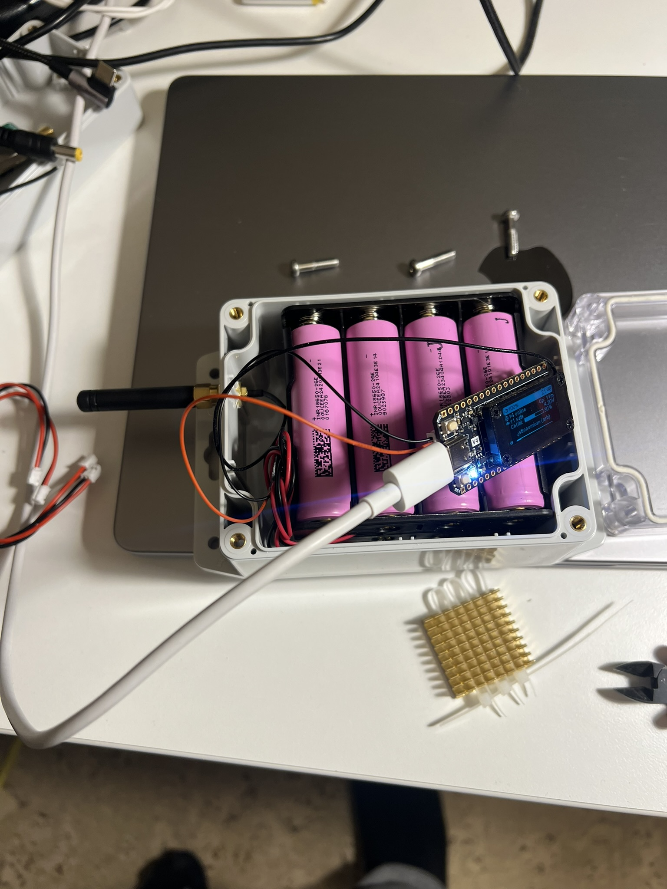
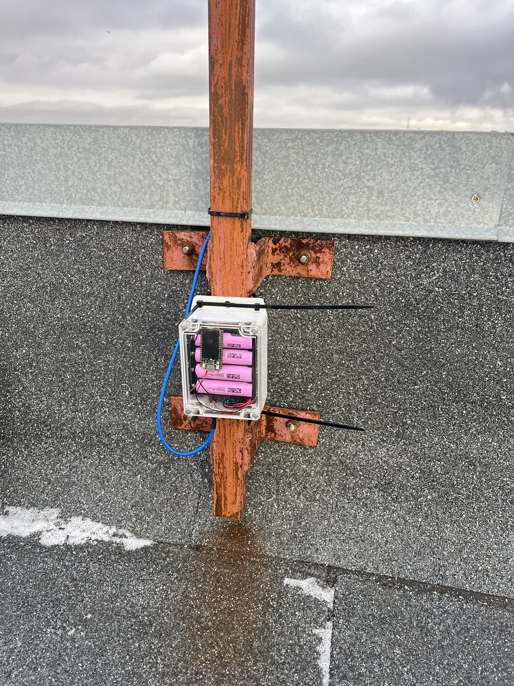

# Astronomikon v1

## Описание

Тут просто хотелось поставить антенну наверх - потому сделал автономную ноду - чтобы не парится с монтажем

Аккумуляторы - 8 шт не заряжаю а меняю на привезенные заряженные

На морозе работает около 11 дней

## Характеристики

- **Тип установки**: Открытый воздух, стационарная
- **Питание**: 8x 18650
- **Корпус**: IP65
- **Антенна**: Всенаправленная уличная

## Компоненты

### Основные компоненты

| Компонент | Цена | Где купить |
|-----------|------|------------|
| Heltec V4 | 2500₽ | |
| G212СMF корпус | 775 | [Вольтмастер](https://www.voltmaster-samara.ru/catalog/korpusa_plastikovye/g212smf_korpus_dlya_rea_svetlo_seryy_polikarbonat_s_prozr_kryshkoy_i_flantsami_ip65_115kh90kh55mm/) |
| Плата защиты/заряда аккумулятора TP4056 | 75 | [Озон](https://www.ozon.ru/product/kontroller-modul-plata-zaryada-li-ion-akkumulyatorov-tp4056-type-c-s-zashchitoy-1960049317/) |
| Батарейный отсек 18650 для Li-Ion аккумулятора, 4 слота 2 2 шт | 350 | https://www.ozon.ru/product/batareynyy-otsek-18650-dlya-li-ion-akkumulyatora-4-slota-parallelno-4-sht-1692233107/?oos_search=false |
| Антенна AX-867R | 3500₽ | [Ozon](https://www.ozon.ru/product/vsenapravlennaya-ulichnaya-rfid-antenna-ax-867r-862-872mgts-3015790746/) |
| Кабель в сборе | 600₽ | [Ozon](https://www.ozon.ru/product/kabelnaya-sborka-perehodnik-sma-male-na-n-male-1m-rg-58-pigteyl-dlya-antenny-n-type-k-routeru-s-sma-597994532/?from_sku=1220418982&oos_search=false) |
| Пигтейл | 160₽ | [Ozon](https://www.ozon.ru/product/2-sht-pigteyl-sma-female-u-fl-ipx-adapter-perehodnik-dlya-podklyucheniya-vneshney-antenny-k-wifi-1778034196/) |

**Итого**: 7960₽

### Дополнительные затраты

- Аккумуляторы 18650 - из наличчия

## Фото

