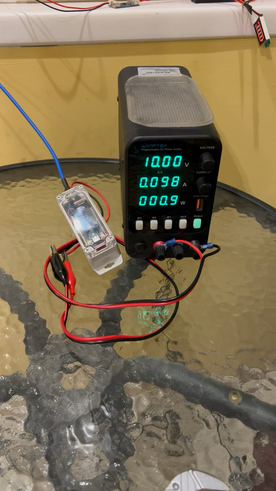

# Кукуруза v1
Это первая нода для установки на открытом воздухе со стацинонарным питанием

## BOM
### Непосредственно нода
- Heltec V4 - 2500р
- Корпус G200CMF - 600 - [Вольтмастер](https://www.voltmaster-samara.ru/catalog/korpusa_plastikovye/g200cmf_korpus_dlya_rea_svetlo_seryy_polikarbonat_ip65_flanets_90kh35kh35mm/)
- Преобразователь DC-DC 200 - [Ozon](https://www.ozon.ru/product/ponizhayushchiy-dc-dc-preobrazovatel-napryazheniya-lm2596s-2sht-1420459707/) 
- Датчик температуры/давления - ~300
- антенна AX-867R - 3500 - [Ozon](https://www.ozon.ru/product/vsenapravlennaya-ulichnaya-rfid-antenna-ax-867r-862-872mgts-3015790746/)
- Кабель в сборе - 600 - [Ozon](https://www.ozon.ru/product/kabelnaya-sborka-perehodnik-sma-male-na-n-male-1m-rg-58-pigteyl-dlya-antenny-n-type-k-routeru-s-sma-597994532/?from_sku=1220418982&oos_search=false)
- Пигтейл - 160 - [Ozon ](https://www.ozon.ru/product/2-sht-pigteyl-sma-female-u-fl-ipx-adapter-perehodnik-dlya-podklyucheniya-vneshney-antenny-k-wifi-1778034196/)

Итого 7860р

### Доп затраты
- Блок питания 12v
- Кабель питания пгв 0,75 x 45м

## Фото

