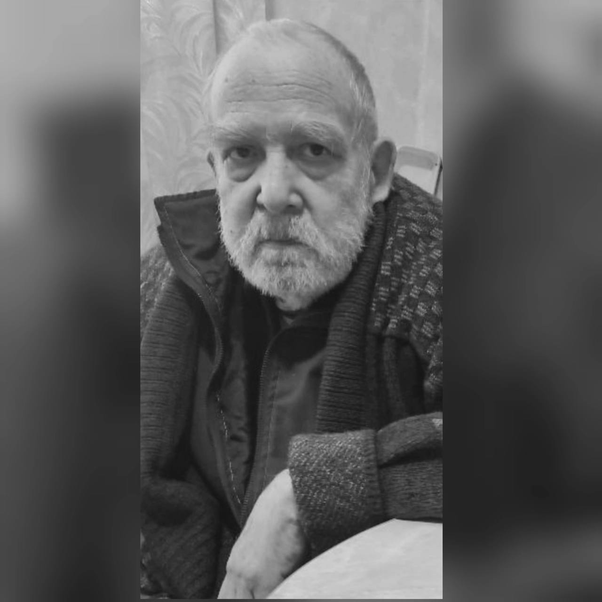

Круглый стол на частоте R3 
23 апреля 2025 19:00

## Участники
- r4hkz
- r4hlu 
- ra4hhw
- ub4huq
- r4hgb
- rw4pz Нижнекамск
- r4hf
- r4hfj
- r4hlh
- r4kk
- rd4hx
- r4hlg
- r4hls
- r4kr

## События

### Ушел из жизни Юрий RX4HE
19 апреля после продолжительной болезни ушел от нас Кутлахмедов Юрий Фидаевич (RX4HE).
Прощание состоится в среду 23.04.2025,по адресу г. Кинель, ул. Колхозная, 34. 
Похороны переносятся на среду в 12-00.

[//]: # (Генерал-майор в отсnавке, конструкторк трансиверов, усилителей)

### Дивизион провел выездную выставку во время фестиваля "Гордимся победой" 
19 апреля Силами Дивизиона было проведена выставка связной аппаратуры 
в рамках патриотического фестиваля и Чемпионата Самарской области по гонкам на квадроциклах «Гордимся Победой».
Он прошел на площадке Ассет - Арена недалеко от Красного Яра.

В организации участвовали:
- Виктор "Киров" R4HIM
- Валерий "Соловей" UB4HUQ
- Андрей "Нубчик" R4HKZ
- Игорь "Кабул" UB4HUK
- Наталья "Багира" R4HDZ
- Александр "Шапран" R4HGC
- Артем "Дракон"
- Павел «Специалист»
- Евгений Маклов - 

### 43-й слет радиолюбителей Самарской области
С 8 по 10 августа 2025 года будет проводиться 43-й слет радиолюбителей Тольятти и Самарской области.

Мероприятие будет проведено на территории турбазы "Россиянка" на полуострове Копылово.

Регистрация участников и более полная информация на http://r4h.ru/slet2025.php

Домики на турбазе 5-ти и 6-ти местные. Стоимость одного места в домике 600 рублей с человека в сутки, но нужно скооперироваться заранее, так как можно снять только домик целиком.
- 5-ти местный домик - 3000р за сутки,
- 6-ти местный - 3600 рублей за сутки.
- Палаточное место на сутки стоит 200р.
- Гостевое посещение стоит 200р.

Если заезжаем в пятницу и выезжаем в воскресенье до 13.00 то оплатить придётся двое суток проживания, но если пожелаем задержаться до 20.00, то нужно будет доплатить по 100р с человека.

Домики нужно бронировать заранее.

Предложения и замечания по программе слета подавайте на мессенджеры телеграмм, этот форум или пишите на kdk@r4h.ru

## КВ соревнования 26 апреля 2025
[Регламент](2025_04_26_regl_HF.pdf)

Чемпионат Самарской области (радиосвязь на КВ - телефон) по радиоспорту

http://r4h.ru/context/chso25kv.pdf

- **Диапазон:** 160, 80, 40 метров
- **Вид излучения:** - SSB, телефон
- **Время проведения**: 26 апреля с 20:00 по 24:00 по Самарскому, в 2 тура по 2 часа

## День активности на УКВ в FT8
**Время проведения** 26 апреля 2025

## УКВ Соревнования 17 мая 2025 
[Регламент](2025_05_17_regl_VHF.pdf)

Кубок Самарской области по радиосвяязи на УКВ

http://r4h.ru/context//10.pdf
- **Диапазон:** 2 метра
- **Вид излучения:** FM, телефон
- **Время проведения:** 17 мая суббота с 18:00 по 20:00 по Самарскому времени, 6 туров по 20 минут

## Мемориал Победа 80
### Положение мемориала
[Положение мемориала Победа 80](Polozhenie-Pobeda-80.pdf)

Основная цель Мемориала – увековечить память о подвигах (заслугах) совершённых на фронте и в тылу в период Великой Отечественной войны. 

Специальные позывные оформляются в честь:
- защитников и жителей Городов-Героев
- городов воинской славы России
- воинских подразделений
- Героев Советского Союза и кавалеров ордена Славы 
- предприятий, организаций, объединений и отдельных граждан 

Эта цель достигается:
- работой мемориальных станций, включая передачу во время радиосвязей мемориальными радиостанциями 2 информации об исторических событиях, в честь которых они работают
- рассылкой памятных QSL – карточек и диплома «Победа-80»
- созданием памятных страниц на радиолюбительских ресурсах в сети Интернет
- других действий, направленных на увековечивание памяти подвигов

### Период проведения Мемориала
**Начало:** 1 мая 2025, 04:00 Самарского
**Окончание:** 9 мая 2025, 19:00 Самарского

### Участие Самары в арботе мемориала
Зарегистированы паямтные позывные
- **rp80i** - Ил2 Штуромовик
- **rp80zs** - Самара - запасная столица

Координацию действий выполняет 
- UA4HGL Дмитрий Богачев
- RW4HB Сергей Голобоков

## Демонстрация техники 10 мая 2025 года
Повтор выезда 19 апреля

10 мая с 12:00 по 19:00 
