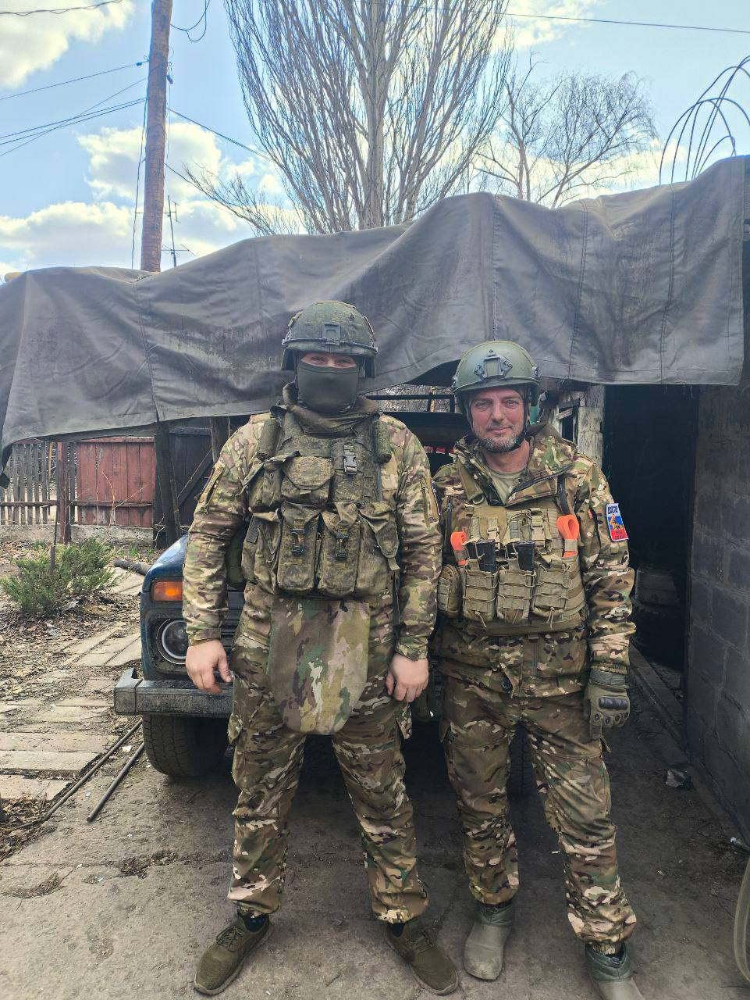
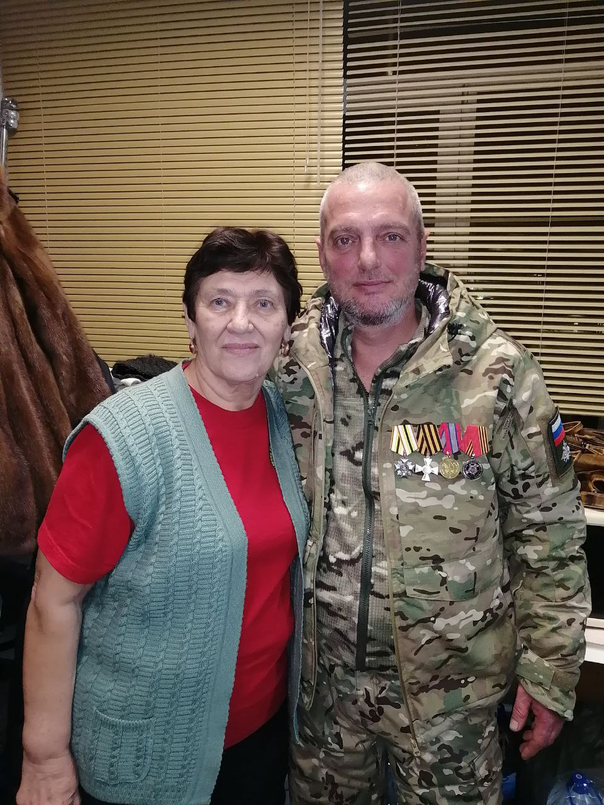
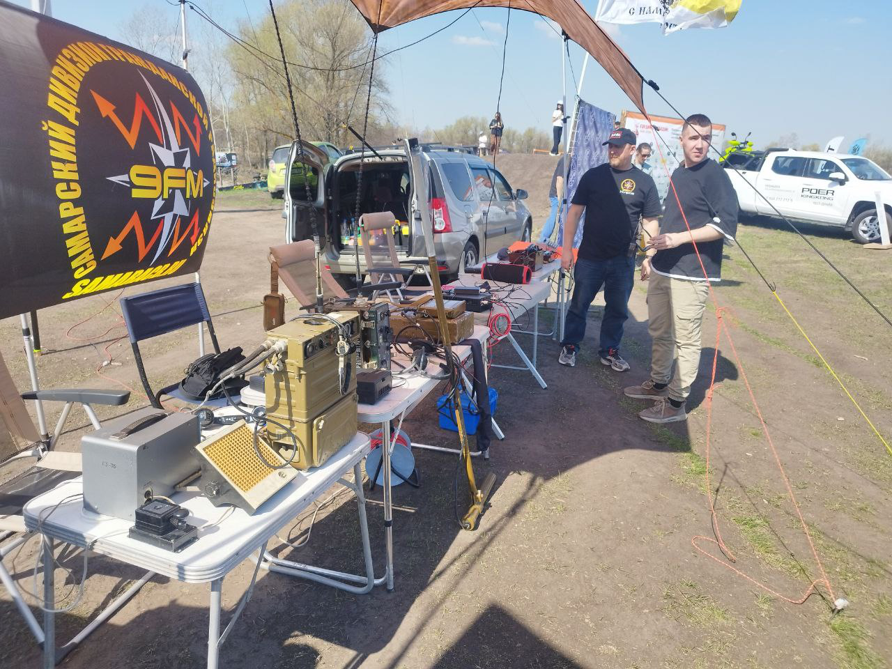

# 6 мая 2025 на частоте Дивизиона

Запись: [VK Video](https://vkvideo.ru/video5280939_456239069)

## Участники

1. Нубчик
2. Горизонт
3. Соловей
4. Камыш
5. Лайнер
6. Луна
7. Киловат
8. Боец
9. Киров R4HIM
10. Плюс
11. Волжанин

## События прошедшие

### Погиб Виталий позывной "Лесник"

К сожалению трагически погиб наш земляк, Виталий позывной "Лесник" (но многие его знали как "Кантария") на СВО.

Прощание с Виталей прошло 6 мая. С утра до 14.00 можно было попрощаться, в 14.00 митинг и захоронение.  
Поминки в кафе по адресу г. Кинель ул. Ясная д. 21 А (прям вдоль трассы где ФилАвто).  
Прощание прошло по адресу: село Красносамарское Кинельский район ул. Кооперативная д.1 Дом Культуры

### Дивизион посетил Обсерваторию

3 мая 2025г

## События грядущие

### 21 мая Заседание КК в СРР

Следующее очередное заседание квалификационной комиссии пройдет **21 мая 2025г**

После этого КК уйдет на каникулы до сентября.

## Планируемые мероприятия

### 7 мая — День радио

День радио — праздник работников всех отраслей связи (профессиональный праздник)

**7 мая** 1895 года российский физик Попов на заседании Русского физико-химического общества продемонстрировал «прибор, предназначенный для показывания быстрых колебаний в атмосферном электричестве»

Мы же собираемся отметить этот праздник встречей в радиоклубе по адресу ул. Аэродромная, 40

Юрий "Коперник" расскажет об участии в радиолюбительских соревнованиях

**Собираемся к 17:00** (предпраздничный день)  
Приносим с собой чай и плюшки

### 8 мая — встреча Дивизиона у ПХ

Традиционно встречаемся на парковке у Парк-Хауса около перевернутого дома

Также не забываем чай и печеньки

### 9 мая — автопробег "Ветеранам глубинки — заботу и внимание"

9 мая в нашей области состоится традиционный ежегодный автопробег "Ветеранам глубинки — заботу и внимание".

Эта замечательная акция была начата уже давно активистами движения УАЗ-Патриот. И к ней каждый год присоединялись люди разных организаций, обществ и просто люди, которым это значимо.

Отчет группы: https://vk.com/@20401006-pyatyi-marshrut

Подробности: https://t.me/avtoprobeg63

### 10 мая — выставка радиотехники на Набережной

Будем организовывать работу палатки с техникой

